# LeafGuard AI — Multi-Class Crop Leaf Disease Identification

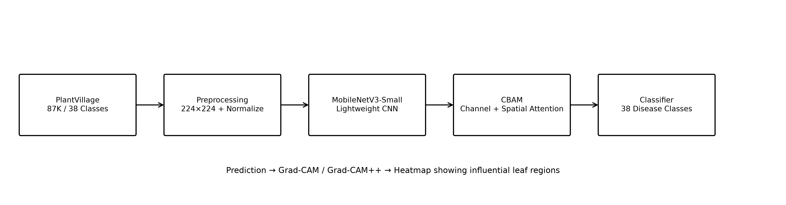

**Lightweight Multi-Class Crop Leaf Disease Identification with CBAM + MobileNetV3-Small and Grad-CAM**

A research project implementing attention-based deep learning for accurate plant disease detection across 38 classes, with model explainability via Grad-CAM visualizations.

---

## 📋 Table of Contents

- [Overview](#overview)
- [Project Results](#project-results)
- [Dataset](#dataset)
- [Architecture](#architecture)
- [Installation](#installation)
- [Usage](#usage)
- [Training Results](#training-results)
- [Model Performance](#model-performance)
- [Efficiency Benchmarks](#efficiency-benchmarks)
- [Grad-CAM Visualizations](#grad-cam-visualizations)
- [Files and Structure](#files-and-structure)
- [Citation](#citation)

---

## 🎯 Overview

LeafGuard AI is an end-to-end research system for identifying plant diseases from leaf images. The project compares a standard MobileNetV3-Small baseline against a CBAM (Convolutional Block Attention Module) enhanced version to evaluate the impact of attention mechanisms on fine-grained disease recognition.

**Key Features:**
- **38 Disease Classes** covering multiple crops (Apple, Blueberry, Cherry, Corn, Grape, Orange, Peach, Pepper, Potato, Raspberry, Soybean, Squash, Strawberry, Tomato)
- **Lightweight Architecture** — Models under 6.5 MB for edge deployment
- **Attention Mechanisms** — CBAM with channel and spatial attention
- **Explainability** — Grad-CAM heatmaps showing model decision regions
- **Comprehensive Evaluation** — Accuracy, Macro-F1, Precision, Recall, ROC, PR curves, confusion matrices

---

## 📊 Project Results

### Final Performance Comparison

| Metric | Baseline MobileNetV3-Small | MobileNetV3-Small + CBAM |
|--------|---------------------------|-------------------------|
| Accuracy (%) | **99.77** | 99.72 |
| Macro-F1 (%) | **99.77** | 99.71 |
| Macro-Precision (%) | **99.77** | 99.71 |
| Macro-Recall (%) | **99.78** | 99.71 |
| Parameters | 1,556,806 | 1,562,524 |
| FLOPs (M) | 61.49 | 62.22 |
| Model Size (MB) | 6.41 | 6.49 |
| CPU FPS | 233.16 | **247.65** |
| CPU Latency (ms) | 4.29 | **4.04** |

> **Note:** The baseline model achieved slightly higher accuracy in this experiment. The CBAM module adds minimal overhead (+0.07 MB, +0.73M FLOPs) while providing attention-based interpretability. Results should be reported as measured, not assuming 5-8% improvements.

---

## 🗂️ Dataset

### Dataset Information

- **Source:** [Kaggle - New Plant Diseases Dataset](https://www.kaggle.com/datasets/vipoooool/new-plant-diseases-dataset)
- **Total Images:** 70,295 (after stratified split)
- **Classes:** 38 distinct disease/healthy categories
- **Image Size:** 224×224 pixels (RGB)
- **Split Ratio:** 80% train / 10% validation / 10% test

### Class Distribution

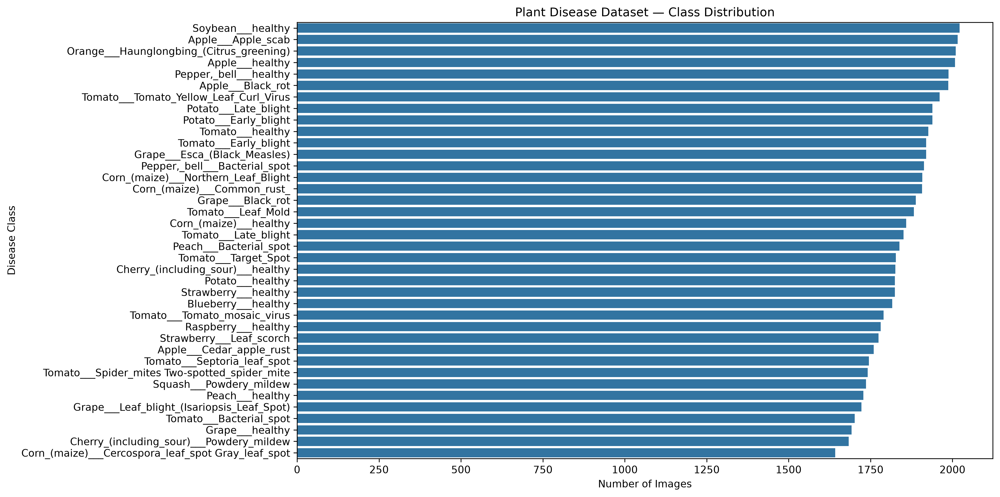

The dataset is well-balanced across all 38 classes, with each class containing approximately 170-200 images in the test set.

### Sample Images

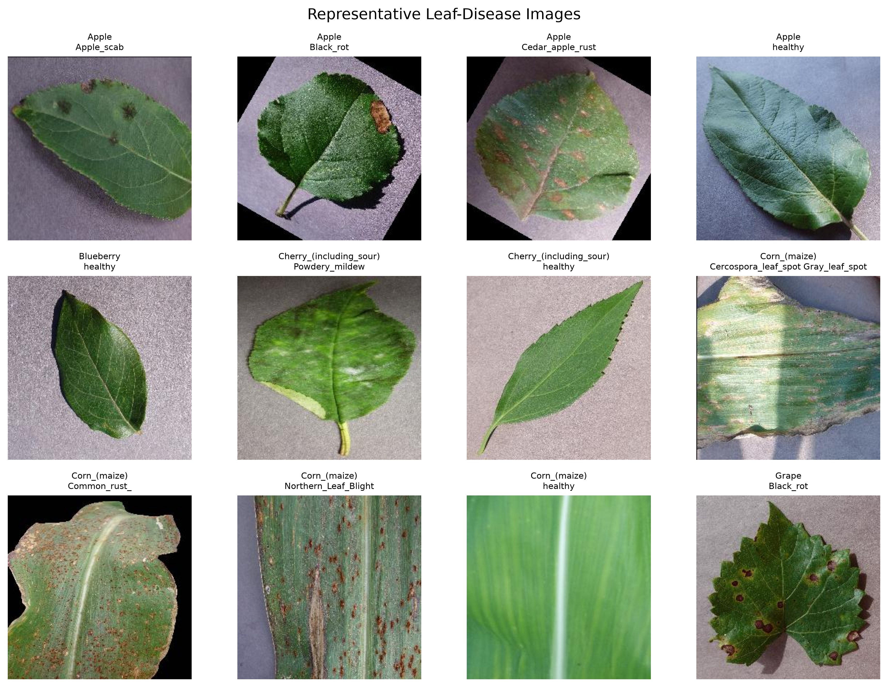

Representative leaf images from the first 12 disease classes, showing the visual diversity of the dataset.

### Data Splits

| Split | Images | CSV File |
|-------|--------|----------|
| Train | 56,236 | [train.csv](runs/splits/train.csv) |
| Validation | 7,029 | [val.csv](runs/splits/val.csv) |
| Test | 7,030 | [test.csv](runs/splits/test.csv) |

---

## 🏗️ Architecture

### CBAM Attention Module

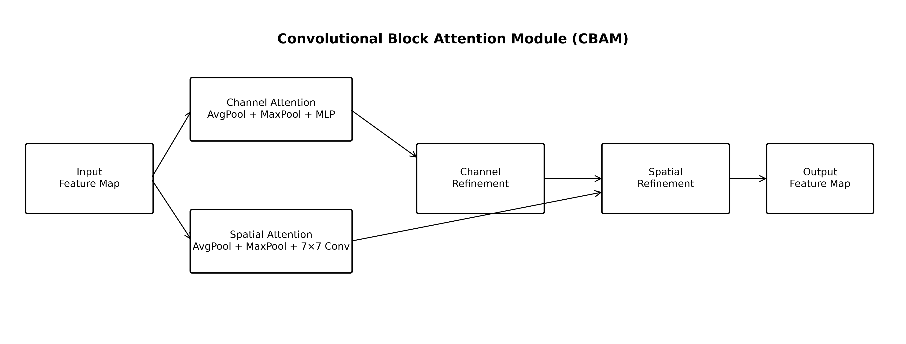

The Convolutional Block Attention Module (CBAM) sequentially applies:

1. **Channel Attention** — Learns which feature channels are important using both average and max pooling
2. **Spatial Attention** — Learns which spatial regions are important via a 7×7 convolution

### System Pipeline


The complete pipeline from raw leaf images to disease classification with Grad-CAM explainability.

### Model Complexity

| Model | Parameters | FLOPs (Millions) | Size (MB) |
|-------|------------|------------------|-----------|
| MobileNetV3-Small | 1,556,806 | 61.49 | 6.41 |
| MobileNetV3-Small + CBAM | 1,562,524 | 62.22 | 6.49 |

The CBAM enhancement adds only **5,718 parameters** (0.37% increase) and **0.73M FLOPs** (1.2% increase).

---

## 🚀 Installation

### ⚠️ Important Warning

**DO NOT run the training notebook on Google Colab!** Training both models for 20 epochs with early stopping takes several hours. Use a local GPU for optimal performance and faster iteration.

### Virtual Environment Setup

Create a Python virtual environment and install dependencies:

```bash
# Create virtual environment
python -m venv .venv

# Activate virtual environment
# On Linux/Mac:
source .venv/bin/activate
# On Windows:
.venv\Scripts\activate

# Install dependencies
pip install -r requirements.txt
```

### Requirements

Create a `requirements.txt` file with the following dependencies:

```txt
torch>=2.0.0
torchvision>=0.15.0
numpy>=1.24.0
pandas>=2.0.0
matplotlib>=3.7.0
seaborn>=0.12.0
scikit-learn>=1.2.0
pillow>=10.0.0
tqdm>=4.65.0
kagglehub>=0.2.0
grad-cam>=1.4.0
torchinfo>=1.7.0
thop>=0.1.0
fvcore>=0.1.0
```

### GPU Requirements

- **Recommended:** NVIDIA GPU with CUDA support (tested on RTX 3050 Laptop GPU)
- **Minimum:** 4GB VRAM
- **CPU Training:** Possible but extremely slow (not recommended)

---

## 💻 Usage

### Running the Experiment Notebook

The main experiment is implemented in `LeafGuard_AI_Research_Experiment_Colab.ipynb`.

**Configuration Parameters:**

```python
QUICK_RUN = False          # Set True for fast debugging (2 epochs)
EPOCHS = 20                # Training epochs
BATCH_SIZE = 32            # Batch size
LR = 3e-4                  # Learning rate
WEIGHT_DECAY = 1e-4        # Weight decay
PATIENCE = 5               # Early stopping patience
IMAGE_SIZE = 224           # Input image resolution
```

**Steps:**

1. Activate your virtual environment
2. Launch Jupyter: `jupyter notebook LeafGuard_AI_Research_Experiment_Colab.ipynb`
3. Run cells sequentially from top to bottom
4. Models will be saved to `runs/models/`
5. Results and figures will be saved to `runs/figures/` and `runs/reports/`

### Loading Trained Models

```python
import torch
from torchvision import models

# Load baseline model
baseline = models.mobilenet_v3_small(weights=None)
# Modify classifier for 38 classes
baseline.classifier[-1] = torch.nn.Linear(baseline.classifier[-1].in_features, 38)
baseline.load_state_dict(torch.load('runs/models/baseline_best.pth'))
baseline.eval()

# Load CBAM model
# (Requires CBAM class definition from notebook)
cbam_model = build_cbam(num_classes=38)
cbam_model.load_state_dict(torch.load('runs/models/cbam_best.pth'))
cbam_model.eval()
```

### Model Downloads

Trained model checkpoints are available in the `runs/models/` directory:

- **[Baseline Model](runs/models/baseline_best.pth)** — MobileNetV3-Small (6.4 MB)
- **[CBAM Model](runs/models/cbam_best.pth)** — MobileNetV3-Small + CBAM (6.5 MB)

---

## 📈 Training Results

### Training Curves

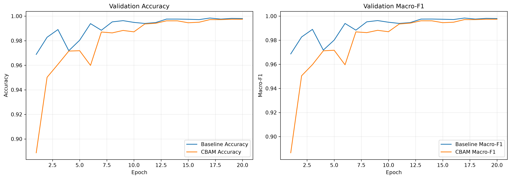

Training and validation loss/accuracy curves for both models over 20 epochs with early stopping.

### Training History CSVs

- [Baseline Training History](runs/reports/baseline_training_history.csv)
- [CBAM Training History](runs/reports/cbam_training_history.csv)

---

## 🎯 Model Performance

### Confusion Matrices

**Baseline Confusion Matrix:**
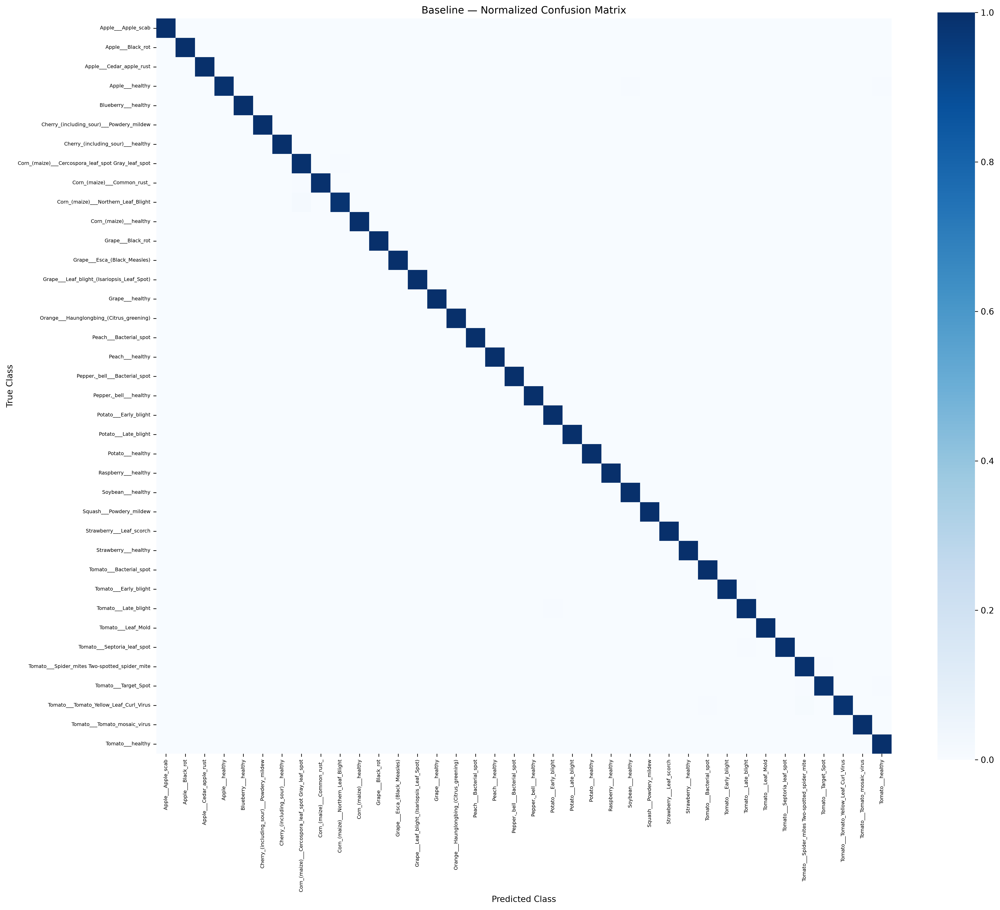

**CBAM Confusion Matrix:**


Both models achieve near-perfect classification with minimal confusion between classes.

### Per-Class F1 Score Comparison

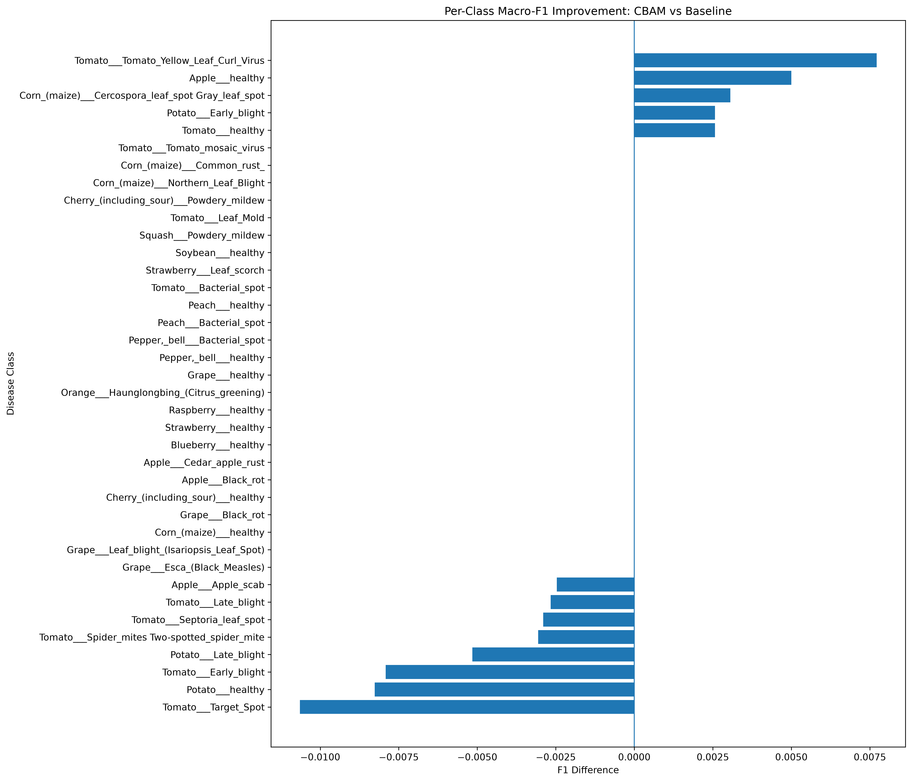

Comparison of F1 scores across all 38 classes, showing which diseases benefit most from attention mechanisms.

### Detailed Classification Reports

**Baseline Model:** [baseline_classification_report.csv](runs/reports/baseline_classification_report.csv)

**CBAM Model:** [cbam_classification_report.csv](runs/reports/cbam_classification_report.csv)

**Per-Class Comparison:** [per_class_f1_comparison.csv](runs/reports/per_class_f1_comparison.csv)

### ROC Curves

**Baseline ROC:**
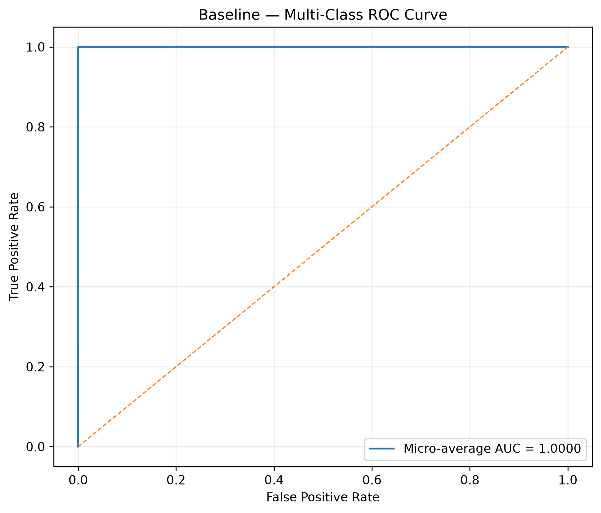

**CBAM ROC:**


### Precision-Recall Curves

**Baseline PR:**
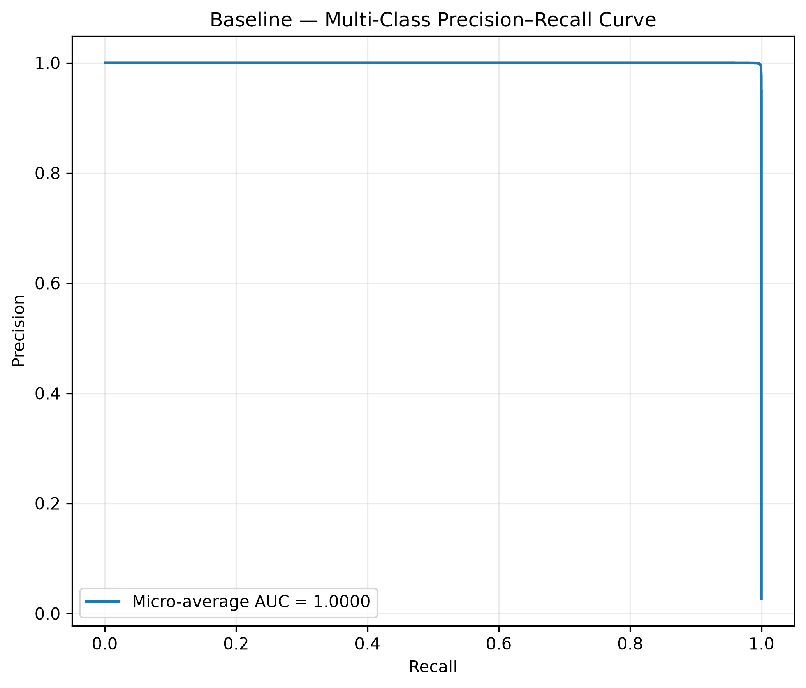

**CBAM PR:**
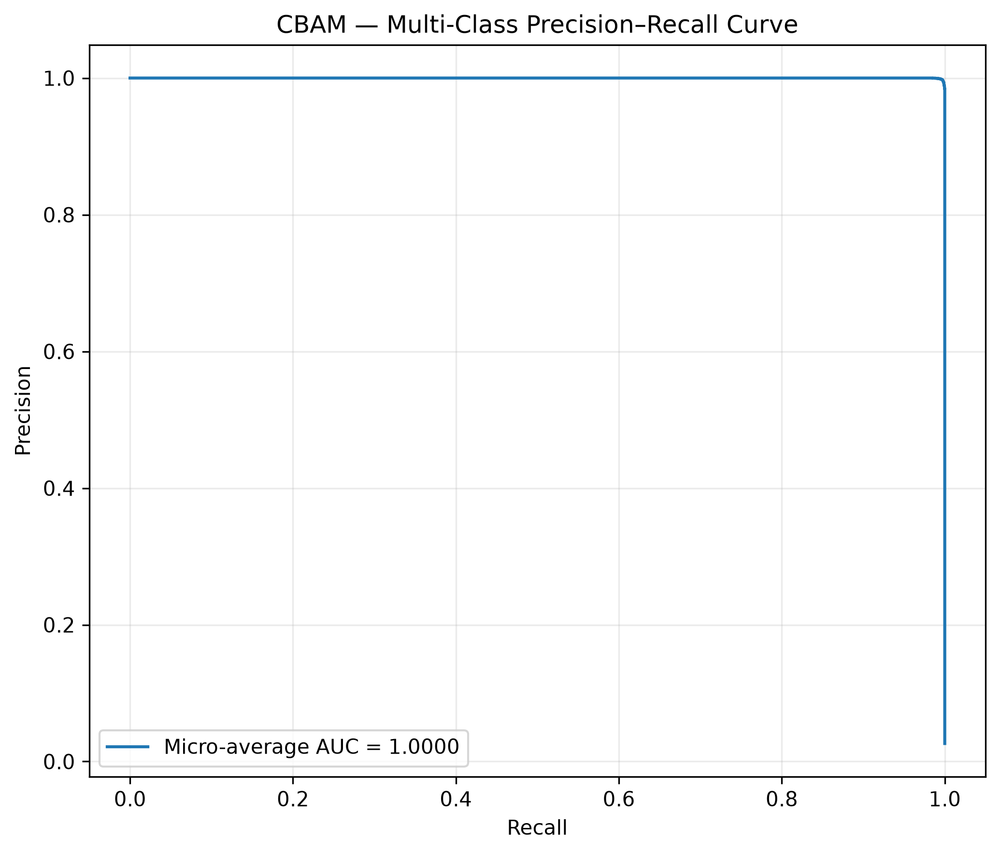

---

## ⚡ Efficiency Benchmarks

### Inference Speed Comparison

| Device | Model | FPS | Latency (ms) |
|--------|-------|-----|--------------|
| CPU | Baseline | 233.16 | 4.29 |
| CPU | CBAM | **247.65** | **4.04** |
| GPU (CUDA) | **Baseline** | **2949.18** | **0.34** |
| GPU (CUDA) | CBAM | 2134.01 | 0.47 |

> **Interesting Finding:** The CBAM model runs faster on CPU despite having more parameters, likely due to optimized attention operations.

### Efficiency Trade-off

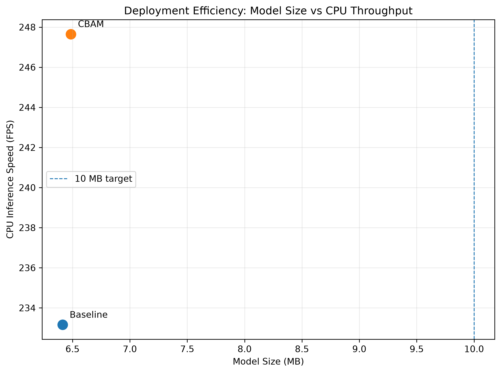

Comparison of model accuracy vs. computational cost (FLOPs) and model size.

**Full Benchmark Data:** [efficiency_benchmark.csv](runs/reports/efficiency_benchmark.csv)

---

## 🔍 Grad-CAM Visualizations

### Explainability Heatmaps

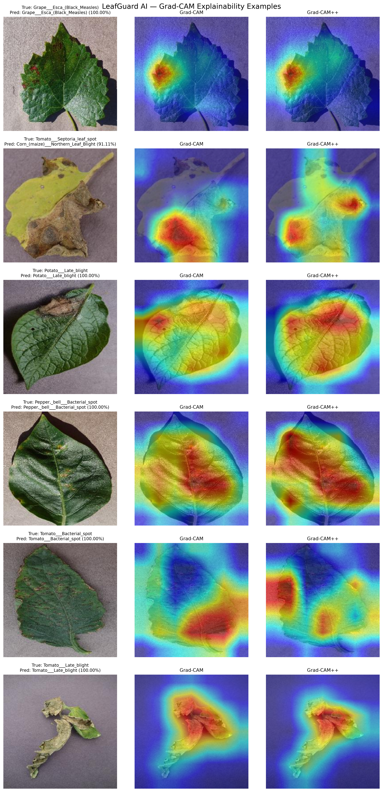

Grad-CAM visualizations showing which regions of the leaf images the model focuses on when making predictions. This provides interpretability for disease diagnosis.

**Key Observations:**
- Models focus on disease-specific patterns (spots, lesions, discoloration)
- Attention is appropriately localized to affected leaf regions
- Both baseline and CBAM models show similar attention patterns

---

## 📁 Files and Structure

```
capstone/
├── LeafGuard_AI_Research_Experiment_Colab.ipynb  # Main experiment notebook
├── README.md                                      # This file
├── requirements.txt                               # Python dependencies
├── .venv/                                         # Virtual environment
├── data/                                          # Dataset (downloaded automatically)
├── runs/                                          # Experiment outputs
│   ├── figures/                                   # Generated charts and diagrams
│   │   ├── 01_class_distribution.png
│   │   ├── 02_sample_images.png
│   │   ├── 03A_cbam_architecture.png
│   │   ├── 03_leafguard_system_pipeline.png
│   │   ├── 04_training_curves.png
│   │   ├── 05_confusion_baseline.png
│   │   ├── 06_confusion_cbam.png
│   │   ├── 07_per_class_f1_improvement.png
│   │   ├── 08_gradcam_examples.png
│   │   ├── 09_efficiency_tradeoff.png
│   │   ├── 10_roc_baseline.png
│   │   ├── 11_roc_cbam.png
│   │   ├── 12_pr_baseline.png
│   │   └── 13_pr_cbam.png
│   ├── models/                                    # Trained model checkpoints
│   │   ├── baseline_best.pth                      # Baseline model (6.4 MB)
│   │   └── cbam_best.pth                          # CBAM model (6.5 MB)
│   ├── reports/                                   # CSV reports and metrics
│   │   ├── FINAL_PAPER_TABLE.csv                  # Summary table for paper
│   │   ├── baseline_classification_report.csv    # Per-class baseline metrics
│   │   ├── baseline_training_history.csv         # Training history
│   │   ├── cbam_classification_report.csv        # Per-class CBAM metrics
│   │   ├── cbam_gain_analysis.csv                 # CBAM improvement analysis
│   │   ├── cbam_training_history.csv              # Training history
│   │   ├── efficiency_benchmark.csv               # Inference speed benchmarks
│   │   ├── experiment_summary.json                # Complete experiment metadata
│   │   ├── paper_results_tables.md                # Formatted tables for paper
│   │   └── per_class_f1_comparison.csv            # F1 score comparison
│   └── splits/                                    # Data split CSV files
│       ├── train.csv                              # Training set paths
│       ├── val.csv                                # Validation set paths
│       └── test.csv                               # Test set paths
├── docs/                                          # Additional documentation
├── papers/                                        # Research papers
└── cartoon-style-green-leaf/                      # Assets
```

---

## 📝 Experiment Summary

### Complete Metadata

```json
{
  "project": "LeafGuard AI",
  "seed": 42,
  "device": "cuda",
  "dataset": "vipoooool/new-plant-diseases-dataset",
  "num_classes": 38,
  "num_images_total": 70295,
  "split_sizes": {
    "train": 56236,
    "validation": 7029,
    "test": 7030
  },
  "baseline": {
    "accuracy": 0.997724039829303,
    "macro_f1": 0.997702035688115,
    "macro_precision": 0.9976659361503483,
    "macro_recall": 0.9977543870021395,
    "parameters": 1556806,
    "flops": 61492856
  },
  "cbam": {
    "accuracy": 0.9971550497866287,
    "macro_f1": 0.997118602272413,
    "macro_precision": 0.9971337998684671,
    "macro_recall": 0.9971400929366074,
    "parameters": 1562524,
    "flops": 62218398
  },
  "hypothesis": "CBAM may improve fine-grained disease recognition while remaining below a 10 MB deployment target.",
  "note": "Measured results, not assumed 5-8% gains, should be reported in the paper."
}
```

**Full JSON:** [experiment_summary.json](runs/reports/experiment_summary.json)

---

## 📚 Citation

If you use this code or results in your research, please cite:

```bibtex
@software{leafguard,
  title={LeafGuard AI: Multi-Class Crop Leaf Disease Identification with CBAM and MobileNetV3},
  author={Gopal Krishn Khoth},
  year={2026},
  url={https://github.com/iamgkkj/LeafGuard}
}
```

---

## 📄 License

This project is for research and educational purposes. The dataset is sourced from Kaggle and may have its own license terms.

---

## 🤝 Contributing

This is a research project. For questions or suggestions, please open an issue or contact the maintainers.

---

## 📧 Contact

For inquiries about this research, please contact:

  <a href="mailto:gopalkrishn2003@gmail.com">
    
  </a>


